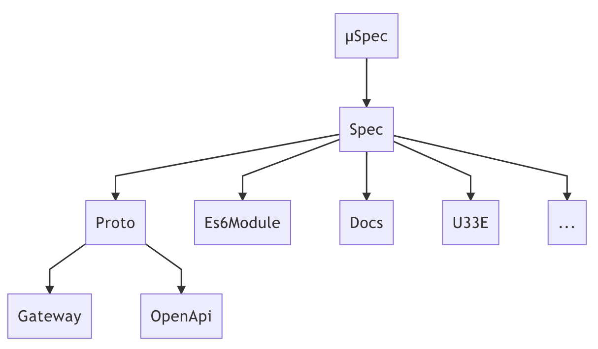

## フロー Furo
Furo spectools is the main utility to work with furo specs ( FIDLs ).

Furo spectools contains helpful generators, converters, sanitizer for the furo specs.

### Synopsis

Furo spectools contains helpful generators, converters, sanitizer for the furo specs.
Read more about the single commands in the see also section below.

Calling spectools without any arguments and flags will run the flow runner with the default flow. 
Modify your default flow in the .furo config file to your needs. You can set any of the sub commands as default.

### Installation
#### go get
    TODO: explain how

#### brew

```bash
    brew tap theNorstroem/tap
    brew install furo
```

### Stay In Sync
Furo can produce and consume multiple specification formats.

### Source Of Truth
You have the choice from multiple definition formats as your source of truth. This can be *.proto or one of the FIDLs (µSpec, spec).



[Read more here](https://spectools.furo.pro/docs/sourceoftruth/), to find out what fits best for you.

### Further Documentation
Read more in the [detailed documentation](https://spectools.furo.pro)
